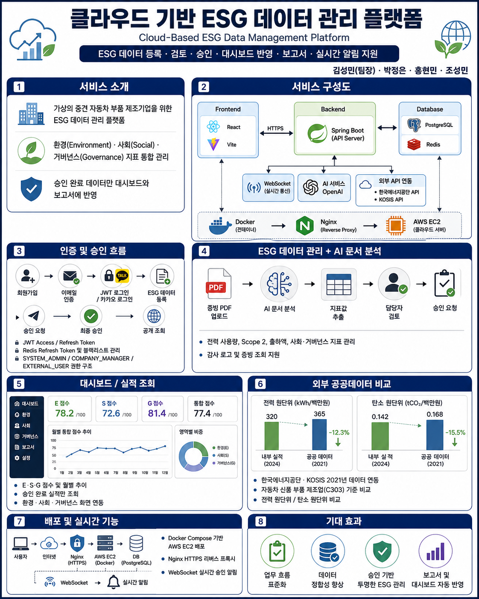
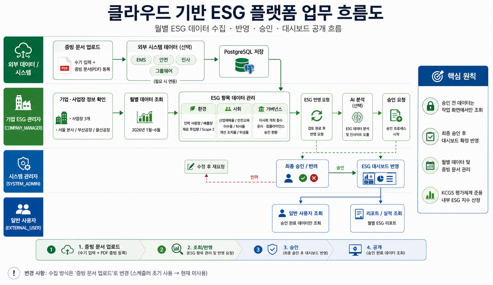
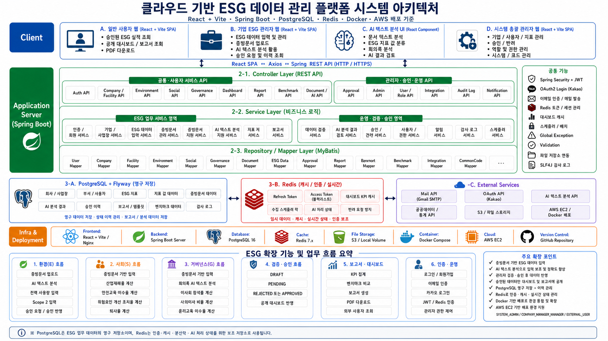
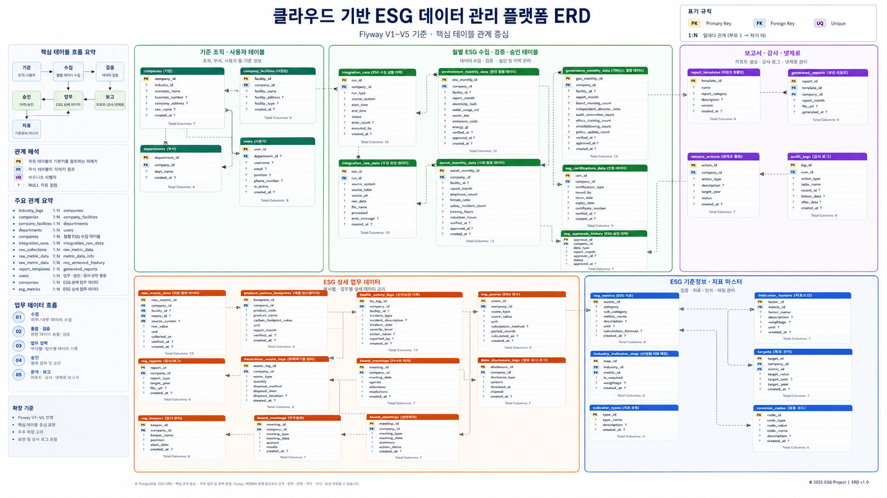

<p align="center">
  
</p>


<h1 align="center">Cloud-Based ESG Data Management Platform</h1>

<p align="center">
  제조기업의 환경·사회·거버넌스 데이터를 등록하고 검토·승인하여<br/>
  대시보드, 실적 조회 및 보고서에 반영하는 클라우드 기반 ESG 데이터 관리 플랫폼
</p>

<p align="center">
  
  
  
  
  
  
  
  
</p>

---

<a id="readme-navigation"></a>
## 🧭 README 바로가기

| 프로젝트 소개 | 주요 구현 | 설계·구조 | 실행·문서 |
|---|---|---|---|
| [📌 프로젝트 개요](#project-overview) | [🔐 인증·권한](#authentication) | [🔄 업무 흐름도](#workflow) | [🎬 기능 시연 영상](#demo-videos) |
| [🎯 개발 목표](#development-goals) | [📊 ESG 데이터 관리](#esg-management) | [🏗 시스템 아키텍처](#architecture) | [📂 프로젝트 산출물](#deliverables) |
| [👥 사용자 권한](#roles) | [🤖 AI·외부데이터](#ai-external-data) | [🗄 ERD](#erd) | [🚀 실행 방법](#run) |
| [🛠 기술 스택](#tech-stack) | [🔔 승인·알림](#approval-notification) | [📁 저장소 구조](#repository-structure) | [🌿 Git 협업 규칙](#git-rules) |
| [🙋 담당 역할](#my-role) | [🧩 핵심 문제 해결](#troubleshooting) | [🗃 주요 DB 테이블](#database-tables) | [📄 지사별 시연 보고서](#demo-reports) |
|  |  |  | [⬆ 맨 위로](#top) |

---

<a id="top"></a>
<a id="project-overview"></a>
## 📌 프로젝트 개요

| 구분 | 내용 |
|---|---|
| 프로젝트명 | 클라우드 기반 ESG 데이터 관리 플랫폼 |
| 프로젝트 배경 | 가상의 중견 자동차 부품 제조기업 `에코모빌리티 파츠 주식회사` |
| 개발 형태 | 4인 팀 프로젝트 |
| 핵심 업무 | ESG 데이터 등록 → 검토·수정 → 승인 요청 → 최종 승인·반려 → 대시보드·보고서 반영 |
| 주요 사업장 | 서울 본사, 부산공장, 대구공장 |
| 배포 환경 | AWS EC2 · Docker Compose · Nginx · HTTPS |

기업의 ESG 데이터가 여러 문서와 담당자에게 분산되어 관리되는 문제를 개선하기 위해, 사업장별 데이터를 하나의 플랫폼에서 등록하고 증빙문서와 연결한 뒤 승인된 데이터만 공식 실적에 반영하도록 구성했습니다.

[⬆ 맨 위로](#readme-navigation)

---

<a id="development-goals"></a>
## 🎯 개발 목표

- 환경·사회·거버넌스 데이터를 사업장과 기준연월 단위로 통합 관리
- 작성자와 승인자를 분리한 권한 기반 승인 업무 구현
- 승인 완료 데이터만 대시보드, E·S·G 실적 및 보고서에 반영
- 증빙 PDF와 ESG 지표 데이터를 연결하여 조회·미리보기·다운로드 제공
- AI 문서 분석으로 반복적인 증빙 확인과 데이터 입력 업무 보조
- 한국에너지공단·KOSIS 공공데이터를 활용한 업종 원단위 비교
- JWT·Redis 기반 인증과 WebSocket 기반 실시간 승인 알림 구현
- Docker Compose를 이용해 로컬과 AWS EC2의 실행 환경 통일

[⬆ 맨 위로](#readme-navigation)

---

<a id="roles"></a>
## 👥 사용자 권한

| 권한 | 역할 | 주요 기능 |
|---|---|---|
| `SYSTEM_ADMIN` | 시스템 총괄 관리자 | 사용자·기업·사업장 관리, 승인 요청 최종 승인·반려, 감사 로그 확인 |
| `COMPANY_MANAGER` | 기업 ESG 관리자 | ESG 데이터 등록·수정, 증빙 첨부, AI 분석, 승인 요청 |
| `EXTERNAL_USER` | 일반 사용자 | 승인 완료 ESG 실적, 공개 증빙 및 보고서 조회 |

```text
COMPANY_MANAGER
데이터 등록·검토·승인 요청
        ↓
SYSTEM_ADMIN
최종 승인 또는 반려
        ↓
APPROVED 데이터만 대시보드·실적·보고서 반영
        ↓
EXTERNAL_USER
공개된 ESG 정보 조회
```

[⬆ 맨 위로](#readme-navigation)

---

<a id="tech-stack"></a>
## 🛠 기술 스택

| 구분 | 기술 | 적용 내용 |
|---|---|---|
| Frontend | React 19.2.7, Vite 8.1.3, React Router, Axios, Chart.js | 권한별 화면, API 통신, ESG 차트와 대시보드 |
| Backend | Java 17, Spring Boot 3.5.x, Spring Security, Validation | REST API, 인증·인가, 승인 업무 처리 |
| Persistence | MyBatis, Flyway | SQL 매핑, DB 마이그레이션 및 시연 데이터 관리 |
| Database | PostgreSQL 16, PostGIS | ESG 원본·상태·이력·문서 메타정보 영구 저장 |
| Cache/Auth | Redis 7.x | Refresh Token, Access Token 블랙리스트, 로그인 실패 잠금, 집계 캐시 |
| Realtime | WebSocket | 승인 요청·승인·반려 실시간 알림 |
| AI | OpenAI API, PDF 텍스트 추출 | 증빙문서에서 지표와 값 분석, 담당자 확인 후 등록 |
| External API | 한국에너지공단, KOSIS | C303 업종 전력·온실가스·출하액 공공데이터 비교 |
| Infrastructure | Docker Compose, Nginx, AWS EC2, HTTPS | 컨테이너 통합 실행, 정적 파일 제공, 리버스 프록시 및 배포 |
| Collaboration | GitHub, Pull Request, Slack, Notion | 브랜치 기반 협업, 문서화 및 일정 관리 |

[⬆ 맨 위로](#readme-navigation)

---

<a id="authentication"></a>
## 🔐 인증·권한

- 일반 회원가입 및 이메일 인증
- BCrypt 비밀번호 암호화
- 카카오 OAuth2 소셜 로그인
- JWT Access Token·Refresh Token 발급
- Access Token 만료 시 Refresh Token 기반 재발급
- Redis에 Refresh Token 저장
- 로그아웃 시 Refresh Token 삭제 및 Access Token 블랙리스트 등록
- 로그인 실패 횟수 저장과 임시 계정 잠금
- `SYSTEM_ADMIN`, `COMPANY_MANAGER`, `EXTERNAL_USER` 권한별 라우팅 및 API 접근 제어
- 새로고침 후 로그인 상태 복구

[⬆ 맨 위로](#readme-navigation)

---

<a id="esg-management"></a>
## 📊 ESG 데이터 관리

### 환경 Environment

- 전력 사용량
- Scope 2 온실가스 배출량
- 출하액
- 전력 원단위
- 탄소 원단위

### 사회 Social

- 산업재해율
- 안전교육 이수율
- 위험요인 개선 조치율
- 퇴사율

### 거버넌스 Governance

- 이사회 참석률
- 사외이사 비율
- 윤리교육 이수율

### 공통 기능

- 사업장·기준연도·기준월별 ESG 데이터 등록·조회·수정·삭제
- 상태 관리: `DRAFT → PENDING → APPROVED / REJECTED`
- 증빙 PDF 업로드, 미리보기 및 원본 다운로드
- 반려 사유 확인 후 수정·재승인 요청
- 승인 완료 데이터만 대시보드와 E·S·G 실적 화면에 반영
- 조건 검색, 서버 페이징 및 처리 이력 조회
- 감사 로그를 통한 사용자 작업 이력 확인

[⬆ 맨 위로](#readme-navigation)

---

<a id="ai-external-data"></a>
## 🤖 AI 문서 분석·외부데이터 비교

### AI 증빙문서 분석

```text
PDF 업로드
→ 문서 텍스트 추출
→ AI 지표·값 분석
→ 담당자 결과 검토
→ ESG 데이터 입력
→ 승인 업무 진행
```

AI 결과는 자동 확정하지 않고 담당자의 판단을 돕는 보조 정보로 사용했습니다.

### 공공데이터 비교

- 비교 업종: 자동차 신품 부품 제조업 `C303`
- 외부 기준연도: 2021년
- 한국에너지공단: 업종 전력 사용량·온실가스 배출량
- KOSIS: 업종 출하액
- 내부 승인 실적과 외부 업종 기준을 동일 단위로 표준화
- 전력 원단위: `MWh / 출하액 1억원`
- 탄소 원단위: `tCO₂eq / 출하액 1억원`

기업 전체 원단위는 사업장별 원단위의 평균이 아니라 전체 사용량과 전체 출하액 합계를 기준으로 계산합니다.

[⬆ 맨 위로](#readme-navigation)

---

<a id="approval-notification"></a>
## 🔔 승인·실시간 알림

```text
기업 ESG 관리자 승인 요청
→ PENDING 상태 및 승인 이력 저장
→ 시스템 관리자 WebSocket 알림
→ 최종 승인 또는 반려
→ 요청 관리자에게 결과 알림
→ 승인 완료 데이터 화면 갱신
```

- 헤더 알림 종과 읽지 않은 알림 수 표시
- 승인 요청·승인·반려 실시간 토스트
- 알림 클릭 시 승인 관리 또는 ESG 데이터 관리 화면으로 이동
- 읽음·전체 읽음 처리
- WebSocket 재연결 및 REST API 기반 누락 알림 복구
- 승인 상태와 알림 원본은 PostgreSQL에 저장하고 WebSocket은 실시간 전달에 사용

[⬆ 맨 위로](#readme-navigation)

---

<a id="workflow"></a>
## 🔄 업무 흐름도

[](./docs/02-design/ESG_업무흐름도.png)

> 이미지를 클릭하면 원본 크기로 확인할 수 있습니다.

[⬆ 맨 위로](#readme-navigation)

---

<a id="architecture"></a>
## 🏗 시스템 아키텍처

[](./docs/02-design/ESG_시스템아키텍처도.png)

### 배포 요청 흐름

```text
사용자 브라우저
→ HTTPS / Nginx
→ React 정적 파일 제공
→ /api · /oauth2 · /login/oauth2 리버스 프록시
→ Spring Boot
→ PostgreSQL · Redis · 파일 볼륨
```

WebSocket 경로는 Nginx에서 HTTP/1.1과 `Upgrade`, `Connection` 헤더를 적용해 Spring Boot로 전달합니다.

[⬆ 맨 위로](#readme-navigation)

---

<a id="erd"></a>
## 🗄 ERD

[](./docs/02-design/ESG_ERD.png)

> 이미지를 클릭하면 원본 크기로 확인할 수 있습니다.

[⬆ 맨 위로](#readme-navigation)

---

<a id="database-tables"></a>
## 🗃 주요 DB 테이블

| 영역 | 주요 테이블 | 역할 |
|---|---|---|
| 기업·조직 | `companies`, `facilities`, `departments` | 기업과 사업장 기준정보 관리 |
| 사용자·권한 | `users`, `roles`, `user_roles` | 로그인 계정과 권한 관리 |
| ESG 지표 | `esg_indicators`, `indicator_values` | 지표 기준정보와 월별 ESG 값 저장 |
| 승인 | `approval_histories` | 승인 요청·승인·반려 이력 저장 |
| 증빙 | `evidence_files` | 실제 파일 경로와 문서 메타정보 저장 |
| 알림 | `notifications` | 사용자별 승인 알림 원본 저장 |
| 감사 | `audit_logs` | 사용자 작업과 변경 이력 저장 |
| 외부 데이터 | 외부 통계 저장 테이블 | 한국에너지공단·KOSIS 원본 및 변환값 저장 |

PostgreSQL은 업무 데이터의 원본과 상태·이력을 영구 저장하며, Redis는 인증·캐시 등 임시성과 속도가 중요한 데이터에 사용합니다.

[⬆ 맨 위로](#readme-navigation)

---

<a id="demo-videos"></a>
## 🎬 기능 시연 영상

<table>
  <tr>
    <td width="50%" align="center">
      <a href="https://youtu.be/mSzDqIOZ5BU">
        
      </a><br/>
      <b>회원가입 · 이메일 인증 · 카카오 소셜 로그인</b>
    </td>
    <td width="50%" align="center">
      <a href="https://youtu.be/G8clN-M69lM">
        
      </a><br/>
      <b>공장 등록 · 외부데이터 연동</b>
    </td>
  </tr>
  <tr>
    <td width="50%" align="center">
      <a href="https://youtu.be/DB7VGd_cVts">
        
      </a><br/>
      <b>ESG 데이터 등록 · AI 문서 분석 · 감사 로그</b>
    </td>
    <td width="50%" align="center">
      <a href="https://youtu.be/189rg4UK7DE">
        
      </a><br/>
      <b>AWS EC2 · Docker Compose · HTTPS 배포</b>
    </td>
  </tr>
</table>

[⬆ 맨 위로](#readme-navigation)

---

<a id="demo-reports"></a>
## 📄 지사별 시연용 ESG 보고서

프로젝트의 ESG 데이터 등록, AI 문서 분석, 증빙 조회, 승인 및 보고서 다운로드 흐름을 시연하기 위해  
**서울 본사·부산공장·대구공장의 환경·사회·거버넌스 보고서를 가상 데이터 기반 시연 자료로 구성**했습니다.

> 아래 보고서는 실제 기업 공시자료가 아닌 포트폴리오 및 기능 시연용 문서입니다.  
> 보고서에 포함된 기업명, 수치와 인적 정보는 프로젝트 시나리오를 위해 작성한 가상 정보입니다.

### 서울 본사 환경 보고서 예시

<p align="center">
  <a href="./docs/06-demo-reports/서울본사/환경/환경_온실가스배출량_보고서.pdf">
    
  </a>
</p>

| 구분 | 내용 |
|---|---|
| 사업장 | 서울 본사 |
| ESG 영역 | 환경 Environment |
| 보고서 | `환경_온실가스배출량_보고서.pdf` |
| 활용 목적 | AI 문서 분석, ESG 지표값 확인, 증빙 등록·승인 및 보고서 조회 시연 |
| 파일 위치 | `docs/06-demo-reports/서울본사/환경/환경_온실가스배출량_보고서.pdf` |
| 바로 보기 | [📕 서울 본사 환경 온실가스배출량 보고서 열기](./docs/06-demo-reports/서울본사/환경/환경_온실가스배출량_보고서.pdf) |

GitHub에서는 위 링크를 클릭하면 PDF 뷰어에서 보고서 양식을 확인할 수 있으며, 원본 파일도 내려받을 수 있습니다.

### 보고서 폴더 구성

```text
docs/06-demo-reports/
├── README.md
├── 서울본사/
│   ├── 환경/
│   │   ├── 환경_온실가스배출량_보고서.pdf
│   │   └── 환경_전력사용량_보고서.pdf
│   ├── 사회/
│   └── 거버넌스/
├── 부산공장/
│   ├── 환경/
│   ├── 사회/
│   └── 거버넌스/
└── 대구공장/
    ├── 환경/
    ├── 사회/
    └── 거버넌스/
```

보고서 파일은 **사업장 → ESG 영역** 순서로 분류합니다. Git은 빈 폴더를 저장하지 않으므로,  
각 폴더에 실제 PDF를 넣거나 필요하면 `.gitkeep` 파일을 추가합니다.

[⬆ 맨 위로](#readme-navigation)

---

<a id="deliverables"></a>
## 📂 프로젝트 산출물

아래 파일은 지정된 경로에 저장하면 GitHub README에서 바로 열어볼 수 있습니다.

| 구분 | 파일 | README 링크 |
|---|---|---|
| 업무 흐름도 | `docs/02-design/ESG_업무흐름도.png` | [이미지 보기](./docs/02-design/ESG_업무흐름도.png) |
| 시스템 아키텍처 | `docs/02-design/ESG_시스템아키텍처도.png` | [이미지 보기](./docs/02-design/ESG_시스템아키텍처도.png) |
| ERD | `docs/02-design/ESG_ERD.png` | [이미지 보기](./docs/02-design/ESG_ERD.png) |
| 메뉴 구조도 | `docs/01-planning/ESG플랫폼_메뉴구조도.xlsx` | [파일 보기](./docs/01-planning/ESG플랫폼_메뉴구조도.xlsx) |
| 테이블 명세서 | `docs/02-design/ESG플랫폼_테이블명세서.xlsx` | [파일 보기](./docs/02-design/ESG플랫폼_테이블명세서.xlsx) |
| 프로그램 기술서 | `docs/02-design/ESG플랫폼_프로그램기술서.docx` | [파일 보기](./docs/02-design/ESG플랫폼_프로그램기술서.docx) |
| 화면 설계서 | `docs/02-design/ESG플랫폼_화면설계서.pdf` | [파일 보기](./docs/02-design/ESG플랫폼_화면설계서.pdf) |
| 최종 발표 자료 | `docs/05-presentation/ESG플랫폼_최종발표_ppt.pdf` | [파일 보기](./docs/05-presentation/ESG플랫폼_최종발표_ppt.pdf) |
| 서울 본사 환경 보고서 | `docs/06-demo-reports/서울본사/환경/환경_온실가스배출량_보고서.pdf` | [PDF 보기](./docs/06-demo-reports/서울본사/환경/환경_온실가스배출량_보고서.pdf) |

> 현재 패키지에는 업로드된 업무 흐름도·시스템 아키텍처·ERD 이미지가 포함되어 있습니다. 나머지 산출물은 위 파일명과 경로에 맞춰 직접 이동하면 링크가 활성화됩니다.

[⬆ 맨 위로](#readme-navigation)

---

<a id="repository-structure"></a>
## 📁 저장소 구조

```text
ESG/
├── backend/                         # Spring Boot 백엔드
├── frontend/                        # React + Vite 프론트엔드
├── database/                        # DB 스크립트 및 초기 자료
├── infra/                           # Docker·Nginx·배포 설정
├── docs/
│   ├── assets/
│   │   └── esg-platform-banner.png  # 추후 제작할 README 배너
│   ├── 01-planning/
│   │   └── ESG플랫폼_메뉴구조도.xlsx
│   ├── 02-design/
│   │   ├── ESG_업무흐름도.png
│   │   ├── ESG_시스템아키텍처도.png
│   │   ├── ESG_ERD.png
│   │   ├── ESG플랫폼_테이블명세서.xlsx
│   │   ├── ESG플랫폼_프로그램기술서.docx
│   │   └── ESG플랫폼_화면설계서.pdf
│   ├── 03-api/                      # API 명세
│   ├── 04-test/                     # 테스트 계획·결과
│   ├── 05-presentation/
│   │   └── ESG플랫폼_최종발표_ppt.pdf
│   ├── 06-demo-reports/              # 지사별 기능 시연용 ESG 보고서
│   │   ├── README.md
│   │   ├── 서울본사/
│   │   │   ├── 환경/
│   │   │   │   ├── 환경_온실가스배출량_보고서.pdf
│   │   │   │   └── 환경_전력사용량_보고서.pdf
│   │   │   ├── 사회/
│   │   │   └── 거버넌스/
│   │   ├── 부산공장/
│   │   │   ├── 환경/
│   │   │   ├── 사회/
│   │   │   └── 거버넌스/
│   │   └── 대구공장/
│   │       ├── 환경/
│   │       ├── 사회/
│   │       └── 거버넌스/
│   └── meeting-notes/               # 회의록
├── .github/                         # Issue·PR·Workflow
├── .env.example
├── CONTRIBUTING.md
└── README.md
```

[⬆ 맨 위로](#readme-navigation)

---

<a id="my-role"></a>
## 🙋 담당 역할

- 프로젝트 팀장으로 일정·업무 분담·진행 상황 관리
- ESG 업무 흐름과 세 권한 구조 설계
- DB 구조·시스템 아키텍처·화면 흐름 설계
- JWT·Redis 인증과 카카오 OAuth2 로그인 구현·통합
- ESG 데이터 등록·승인·반려 및 승인 완료 데이터 반영
- 대시보드, 환경·사회·거버넌스 실적 화면 통합
- PDF 증빙과 AI 문서 분석 기능 연결
- 한국에너지공단·KOSIS 외부데이터 비교 기능 구현
- WebSocket 실시간 승인 알림 연동
- 팀원 브랜치 병합, 충돌 해결 및 통합 테스트
- Docker Compose·Nginx·AWS EC2 HTTPS 배포

[⬆ 맨 위로](#readme-navigation)

---

<a id="troubleshooting"></a>
## 🧩 핵심 문제 해결

### AWS EC2 HTTPS 환경의 API·OAuth·WebSocket 연결 오류

**문제**  
로컬에서는 정상 동작하던 API, 카카오 OAuth 로그인과 WebSocket 알림이 AWS EC2 HTTPS 환경에서 연결되지 않거나 잘못된 주소로 이동했습니다.

**원인 분석 및 해결**  
개발 환경에서는 Vite 프록시가 요청을 Spring Boot로 전달했지만 운영 빌드에서는 적용되지 않았고, Nginx에 OAuth 콜백과 WebSocket 요청을 전달하는 설정도 부족했습니다. Nginx에 `/api`, `/oauth2`, `/login/oauth2`, `/ws` 리버스 프록시를 구성하고 `X-Forwarded-*` 헤더를 적용했습니다. WebSocket에는 HTTP/1.1과 `Upgrade`, `Connection` 헤더를 추가했습니다. 카카오 인증 성공 후에는 JWT Access/Refresh Token을 발급하고 OAuth 일회용 코드와 Refresh Token을 Redis에서 관리하도록 기존 인증 구조와 연계했습니다.

**결과**  
AWS EC2 HTTPS 환경에서 REST API, 카카오 OAuth 콜백과 WebSocket 실시간 승인 알림이 정상적으로 동작하도록 수정했습니다. JWT와 Redis를 연계해 로그인 유지, 토큰 재발급과 로그아웃 토큰 무효화까지 처리했습니다.

[⬆ 맨 위로](#readme-navigation)

---

<a id="run"></a>
## 🚀 실행 방법

### 1. 환경변수 준비

```bash
cp .env.example .env
```

`.env`에 DB, Redis, JWT, OAuth, 외부 API 관련 값을 설정합니다. 실제 비밀키는 GitHub에 커밋하지 않습니다.

### 2. Docker Compose 통합 실행

```bash
docker compose up -d --build
docker compose ps
docker compose logs -f
```

### 3. 로컬 개별 실행

Backend:

```bash
cd backend

# Windows
gradlew.bat clean build
gradlew.bat bootRun

# macOS / Linux
./gradlew clean build
./gradlew bootRun
```

Frontend:

```bash
cd frontend
npm ci
npm run dev
```

기본 개발 주소:

```text
Frontend: http://localhost:5173
Backend : http://localhost:8080
```

[⬆ 맨 위로](#readme-navigation)

---

<a id="git-rules"></a>
## 🌿 Git 협업 규칙

상세 규칙은 기존 링크인 [`CONTRIBUTING.md`](./CONTRIBUTING.md)에서 확인할 수 있습니다.

```text
feature/* ─┐
fix/*     ─┼─> develop ─> main
refactor/*─┤
docs/*    ─┤
infra/*   ─┘
```

### 작업 시작

```bash
git switch develop
git pull origin develop
git switch -c feature/이슈번호-기능명
```

### 커밋 메시지

```text
feat: ESG 데이터 승인 요청 기능 구현
fix: AWS HTTPS OAuth 콜백 경로 오류 수정
refactor: 대시보드 집계 로직 분리
docs: README 산출물 링크 추가
infra: Nginx OAuth 및 WebSocket 프록시 설정
```

### 작업 완료

```bash
git add .
git status
git commit -m "docs: README와 프로젝트 산출물 구조 정리"
git push -u origin 작업브랜치명
```

[⬆ 맨 위로](#readme-navigation)
